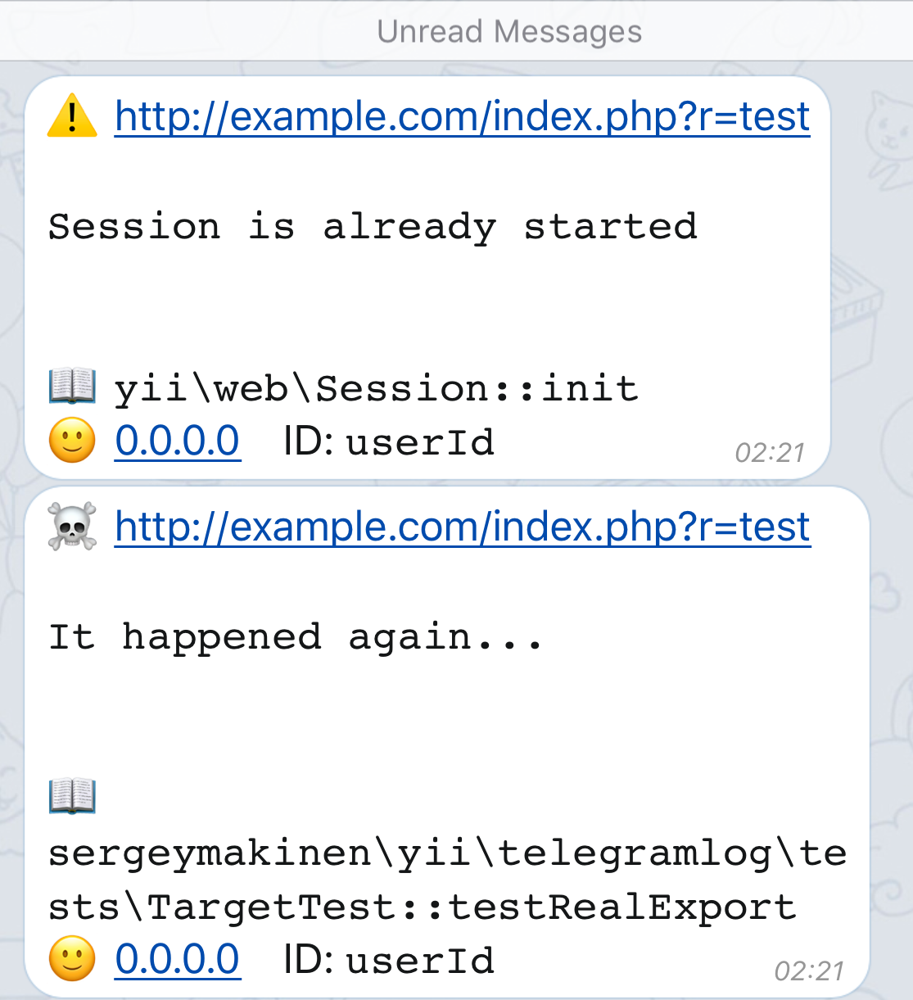

# Telegram log target for Yii 2

[Telegram](https://telegram.org) log target for Yii 2.



[](https://scrutinizer-ci.com/g/sergeymakinen/yii2-telegram-log) [](https://travis-ci.org/sergeymakinen/yii2-telegram-log) [](https://codecov.io/gh/sergeymakinen/yii2-telegram-log) [](https://insight.sensiolabs.com/projects/8b4f3236-7c78-42d1-8355-54605598d941)

[](https://packagist.org/packages/sergeymakinen/yii2-telegram-log) [](https://packagist.org/packages/sergeymakinen/yii2-telegram-log) [](LICENSE)

## Installation

The preferred way to install this extension is through [composer](https://getcomposer.org/download/).

Either run

```bash
composer require "sergeymakinen/yii2-telegram-log:^1.0"
```

or add

```json
"sergeymakinen/yii2-telegram-log": "^1.0"
```

to the require section of your `composer.json` file.

## Usage

First [create a new bot](https://core.telegram.org/bots#6-botfather) and obtain its token. It should look like `123456:ABC-DEF1234ghIkl-zyx57W2v1u123ew11`.

You will also need a [chat ID](https://stackoverflow.com/questions/31078710/how-to-obtain-telegram-chat-id-for-a-specific-user) to send logs to. It should look like `123456789`.

Then set the following Yii 2 configuration parameters:

```php
'components' => [
    'log' => [
        'targets' => [
            [
                'class' => 'sergeymakinen\log\TelegramTarget',
                'token' => '123456:ABC-DEF1234ghIkl-zyx57W2v1u123ew11',
                'chatId' => 123456789,
            ],
        ],
    ],
],
```
